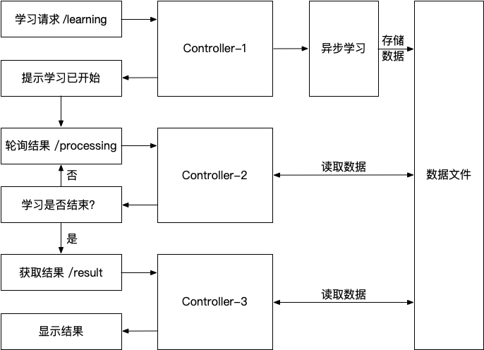

#  模型学习工具站点

模型学习工具站点为确定性单时钟时间自动机的精确模型学习和PAC学习原型工具，使用说明请查看[DOTA_learn工具-演示视频](https://v.qq.com/x/page/o3163qkipvc.html)。本项目所含算法由开发者版权所有，未经允许不得商用。

## 1. 项目结构

### 1.1 前端模块

技术栈：React + Ant Design + axios + [graphviz-react](https://www.npmjs.com/package/graphviz-react) (用于自动机绘制) 

### 1.2 后端模块

技术栈：flask + flask_cors + gunicorn + supervisor + Nginx

### 1.3 接口设计

## 2. 使用和功能描述

在工具站点中，用户可以按照格式说明编写并上传包含目标模型信息的JSON文件，并在参数设置区域配置相关参数，点击开始学习即可进行学习；也可以直接选择提供的示例进行试用，如学习TCP协议。学习方式分为Exact和PAC两种，其区别在于是否运用直接精确判断语言或模型等价的机制；学习类型分为Smart和Normal，两者的区别在于Smart情形下假设能够观察到系统内部时钟是否重置，而Normal情形下需要猜测内部时钟重置情形。精确度和置信度参数为PAC学习中需要设置的两个参数，其提供了对于结果模型的质量保证要求。Guard上界表示模型时钟约束中出现的最大常数，已自动获取。用户还可以为学习过程的总时间设置超时限制，默认设置为5分钟。

如上图所示，区域一中展示了用户在上一步中配置的参数。区域二展示学习过程中的中间结果。在学习类型设置为smart learning时，则可以观察猜想模型不断学习改进的过程，并且工具提供了所有中间过程模型信息下载的功能。由于normal learning情形，需要猜测重置时钟信息，每次产生大量猜想模型，因此暂不支持学习过程的展示。在两种情形下，当学习完成的时候，可以在学习结果展示区域看到原始目标模型与学习结果模型的对比，以及学习过程中的相关数据，并提供了结果模型信息下载及学习结果下载的功能。特别地，在smart learning情形下，学习超时会返回当前的猜想模型。当学习方式设置为Exact时，学习结果中包含学习是否成功、学习过程的总时间、成员查询的数量、等价查询的数量和观察表实例的数量。当设置为PAC时，除了以上信息，还会提供所用测试的总数量，“是否正确”则表示学出的模型是否完成正确，以及在额外验证集中的通过率。

## 2. 成果支撑

### 2.1 相关论文

[1].  Jie An, Mingshuai Chen, Bohua Zhan, Naijun Zhan, Miaomiao Zhang. Learning One-Clock Timed Automata. In: TACAS 2020, pages 444-462. (Artifacts Evaluated)
[2].  Wei Shen, Jie An, Bohua Zhan, Miaomiao Zhang, Bai Xue, Naijun Zhan. PAC Learning of Deterministic One-Clock Timed Automata. In: ICFEM 2020. Accepted, to appear.
[3].  Jie An, Lingtai Wang, Bohua Zhan, Naijun Zhan, Miaomiao Zhang. Learning Real-Time Automata. SCIENCE CHINA Information Sciences 64(7). Accepted, in press.
[4].  Learning One-Clock Timed Automata. Presented at FMAC 2019. (Best Paper Award)

### 2.2 原型工具

1. [exact_learn_DOTAs](https://github.com/MrEnvision/exact_learn_DOTAs) 或 [OTALearning](https://github.com/Leslieaj/OTALearning) + [OTALearningNormal](https://github.com/Leslieaj/OTALearningNormal): This prototype tool is dedicated to actively learning deterministic one-clock timed automata (DOTAs). (The evaluated artifact by TACAS-2020 is also archived in the [Figshare repository](https://doi.org/10.6084/m9.figshare.11545983.v3).)
2. [pac_learn_DOTAs](https://github.com/MrEnvision/pac_learn_DOTAs): This prototype tool is dedicated to actively learning DOTAs under more realistic assumptions within the framework of PAC learning. 

------

如果发现本项目有错误，欢迎提交 issues 指正。